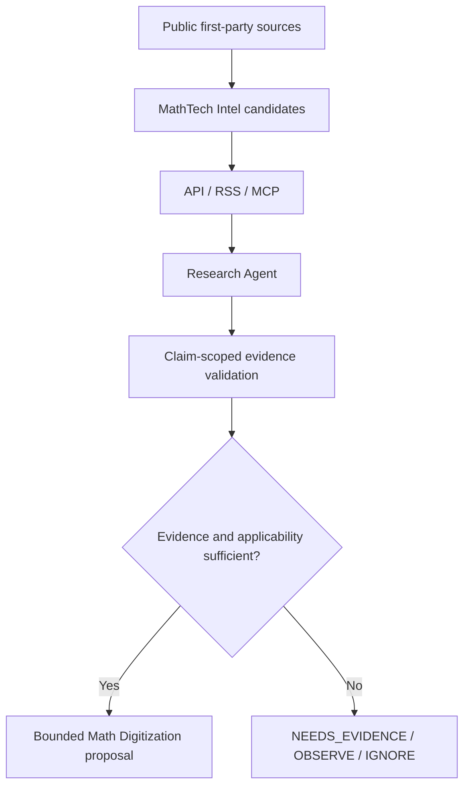

# MathTech Intel v0 架构与边界

## 定位

数学数字化 / 数学文档生产的外部技术情报候选输入层，不是通用 AI 新闻站。当前仅行业配置、离线 fixture 和审计；没有运行数据库、采集 worker 或 live 模型，没有任何公司系统连接。

## Reference-First / Prior-Art Gate

复用官方 AIHOT 行业接口 docs/customize.md、production runAnalysis/ScoreSchema/normalizeAnalysis、SelectBench gold rows/eval-selection.ts、prompt include/hash、统一 publication 和 receipts。未引入第二套 benchmark runner、provider、队列或数据库。industry/mathtech-policy.ts 只是离线 candidate evidence guard，输入为显式证据 metadata，不替代 scorer，也没有 hook 到 worker。

## 当前结构

| 层 | 使用/修改 |
|---|---|
| industry config | site/features/taxonomy/topics/sources/prompts/brand；阈值 selection.ts 不变 |
| fixtures | industry/mathtech.gold.jsonl：upstream gold 格式 + ignored mathtech extension，六个 synthetic development cases |
| evidence guard | industry/mathtech-policy.ts：显式窗口、claim scope、channel、适用性、缺证据 fail closed；只由离线测试调用 |
| tests | tests/mathtech-industry.test.ts 使用现有 Node test；其他修改仅移植旧 industry fixture category/tag/dispatch |
| Core | apps、packages、database、upstream runtime/scripts/lockfile 均不变 |

## Taxonomy 接口映射

| 领域 / category tag | category wire key |
|---|---|
| OCR | OCR |
| DOCUMENT_AI | DOCUMENT_AI |
| MATH_REPRESENTATION | MATH_REPRESENTATION |
| GEOMETRY | GEOMETRY |
| PUBLISHING | PUBLISHING |
| PDF_QA | PDF_QA |
| AGENT_TOOLING | tip |
| INFRASTRUCTURE | INFRASTRUCTURE |
| RESEARCH | RESEARCH |

AGENT_TOOLING 沿用 tip，原因是 publication/items.ts categoryCondition 硬编码；首次纯新 key 的 typecheck 报 TS2367，按 root cause 在 industry contract 内采用 wire alias，未改 Core。legacy opinion 别名读取逻辑仍在上游；空库不创建该类。

ITEM_TYPES 保持七类以复用现有 parser。source tier 与模型 score input 分开；不能用 T1 代替 claim-level evidence。技术二级标签覆盖用户列出的 marker/surya/latex/texlive/quarto/pandoc/asymptote/tikz/verapdf/mathml/pdf/layout/reading_order/formula_recognition/table_extraction/diagram_reconstruction/multimodal/codex。

## 未来接口提案（未实施）

接口只传 public item identity/revision、原文 URL、source authority、四种日期、version/channel、claim/evidence、applicability、verificationState、候选 decision 与最小边界。下游先校验证据，再决定试验；EXPERIMENT 不授予升级/回归/生产写入权限。NEEDS_EVIDENCE 禁止产生执行任务。不要解析自然语言 reason 作为可信 machine decision。

Company Web、Company Ops、Math System runtime、Media production 当前不存在配置、凭据、调用或连接。未来接入应先定义 adapter contract 和独立验证，再由控制面提出任务；不在本轮落地。

## 运行隔离

6 sources 默认 enabled=false，全文/再分发=false，首次 backfill limit=2；industry/prototype.env.example 所有采集、模型、推送、IndexNow/Jina 阀关闭，无 secret。upstream 默认模型和采集阀是开启的，必须显式加载 prototype 关闭项，不能直接 copy 默认 quickstart。

Compose 宿主 web 端口默认发布到所有接口；未来本地 smoke 必须改为 loopback-only，禁 caddy profile、真实域名和外部 DB。本轮环境没有 Docker，未运行 compose config/up/build。现有 Dockerfile/Compose 仅静态审计。
